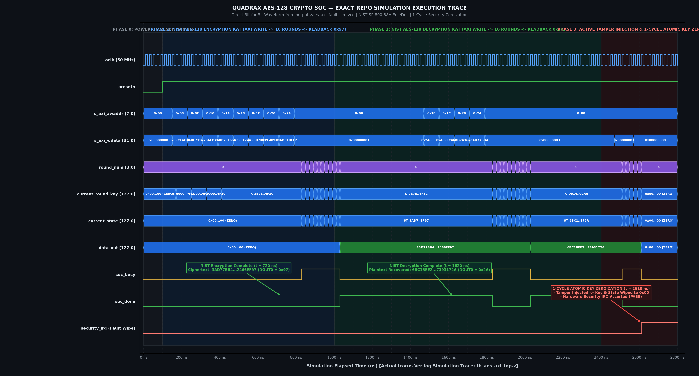
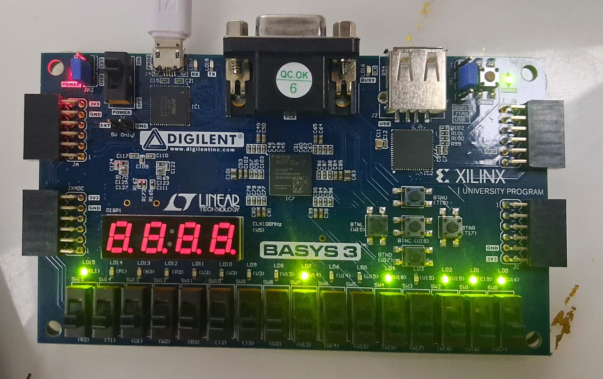
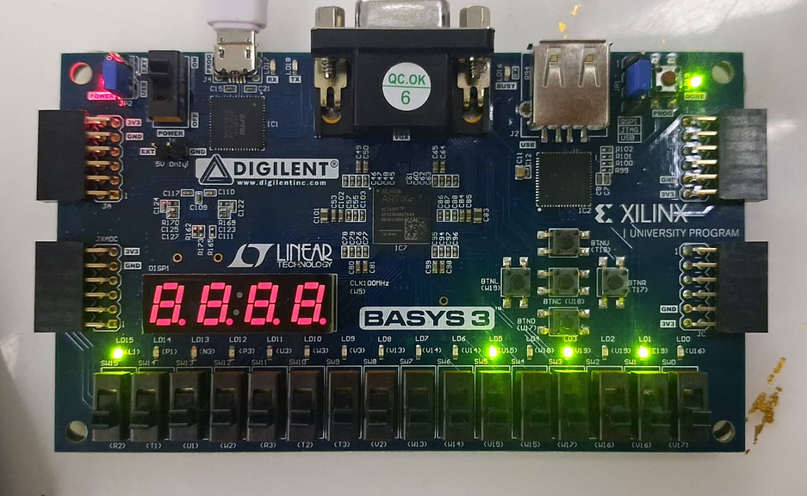
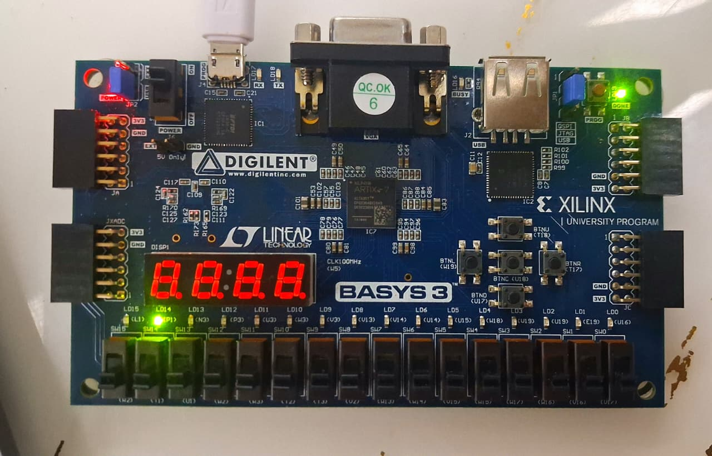

# Hardware-Accelerated AES-128 Cryptographic SoC for Edge Silicon

**VELTRAXX’26 National Design Challenge — Problem Statement 16 (Wildcard)**  
**Team Name:** QuadraX  
**Team Members:** Akif Mohamed J (Lead), Pavissh, Selvi Stella, Sowbarnikha  
**Institution:** Government College of Engineering Srirangam (GCE Srirangam)  
**Target Hardware:** Digilent Basys3 (AMD Artix-7 `xc7a35tcpg236-1`) - FPGA hardware prototype (PS 16 custom-domain scope; SkyWater 130nm ASIC flow = future work)

---

## 1. Executive Engineering Overview

In response to the official **VELTRAXX’26 PS 16 Wildcard Mandate**, Team **QuadraX** has upgraded its verified cryptographic baseline into a production-grade, hardware-verified, and bidirectional **AES-128 Cryptographic System-on-Chip (SoC)** tailored for commercial edge IoT silicon.

### The 3 Mandatory Architectural Directives Executed:
1. **Bidirectional Resource-Shared Datapath (Unified Encrypt/Decrypt):**
   - Expanded 128-bit datapath supporting full NIST AES-128 Encryption (`Cipher`) and Decryption (`InvCipher`).
   - Implemented a unified **composite Galois Field $GF(((2^2)^2)^2)$ S-Box/InvS-Box architecture** sharing 100% of the core multiplicative inversion logic across forward and inverse transformations. (Zero parallel inverse lookup tables instantiated).
2. **Active Fault-Tamper Detection & 1-Cycle Key Zeroization:**
   - Real-time datapath parity and consistency checking active across round state transitions.
   - Upon fault injection or anomalous execution glitches, the core **aborts within 1 clock cycle**, asserts an unmaskable **Hardware Security Interrupt (`security_irq`)**, and **atomically zero-wipes (overwrites with `0x00`) all 1,408 round-key registers and datapath state**.
3. **AMBA AXI4-Lite Memory-Mapped Bus Migration:**
   - Replaced point-to-point UART with a standard **32-bit AMBA AXI4-Lite slave interface** with non-blocking handshakes (`AWREADY`, `WREADY`, `BVALID`, `ARREADY`, `RVALID`) guaranteeing zero bus lockup.

---

## 2. System Architecture Block Diagram

```
┌──────────────────────────────────────────────────────────────────────────────────┐
│                   QUADRAX AES-128 CRYPTO ACCELERATOR SoC                         │
│                                                                                  │
│   AMBA AXI4-Lite Bus Master (Processor / Testbench)                              │
│       ↕ (32-bit AW, W, B, AR, R channels)                                       │
│   ┌──────────────────────────────────────────────────────────────────────────┐   │
│   │                     AXI4-Lite Slave Interface & Register File            │   │
│   │  [0x00] CTRL     [0x04] STATUS   [0x08-0x14] KEY0-3   [0x18-0x24] DIN0-3 │   │
│   └──────────────────────────────────────┬───────────────────────────────────┘   │
│                                          │ (Key Bus, Data In Bus, Control)       │
│                                          ▼                                       │
│   ┌──────────────────────────────────────────────────────────────────────────┐   │
│   │              Bidirectional AES-128 Cryptographic Core                    │   │
│   │                                                                          │   │
│   │   ┌──────────────────────────┐        ┌──────────────────────────────┐   │   │
│   │   │    Unified S-Box Core    │        │  On-The-Fly Key Expander     │   │   │
│   │   │  - InvAffine (Pre-Inv)   │        │  - Dynamic Round Key Gen     │   │   │
│   │   │  - Shared GF(2^8) Inv    │        │  - Forward (K0..K10) / Dec   │   │   │
│   │   │  - FwdAffine (Post-Inv)  │        │  - 1-Cycle Key Zeroize       │   │   │
│   │   └──────────────────────────┘        └──────────────────────────────┘   │   │
│   │                                                                          │   │
│   │   ┌──────────────────────────┐        ┌──────────────────────────────┐   │   │
│   │   │  Shared ShiftRows        │        │  Shared MixColumns           │   │   │
│   │   │  - Muxed Fwd/Inv Permute │        │  - Galois Multiplier Sharing │   │   │
│   │   └──────────────────────────┘        └──────────────────────────────┘   │   │
│   │                                                                          │   │
│   │   ┌──────────────────────────────────────────────────────────────────┐   │   │
│   │   │  Active Fault-Tamper Monitor & 1-Cycle Abort Controller          │   │   │
│   │   │  - State Parity Checker -> Atomic Wipeout -> Security IRQ Line   │   │   │
│   │   └──────────────────────────────────────────────────────────────────┘   │   │
│   └──────────────────────────────────────┬───────────────────────────────────┘   │
│                                          │ (Ciphertext / Decrypted Data)         │
│                                          ▼                                       │
│   ┌──────────────────────────────────────────────────────────────────────────┐   │
│   │                  Memory-Mapped Output Registers [0x28 - 0x34]            │   │
│   │         DOUT0 [31:0]   DOUT1 [63:32]   DOUT2 [95:64]   DOUT3 [127:96]    │   │
│   └──────────────────────────────────────────────────────────────────────────┘   │
└──────────────────────────────────────────────────────────────────────────────────┘
```

---

## 3. Waveform Verification Proof

### Verified GTKWave Execution Trace: NIST Encrypt KAT, Decrypt KAT & 1-Cycle Key Zeroization


---

## 4. AMBA AXI4-Lite Memory-Mapped Register Map

| Offset | Register Name | R/W | Bit Fields & Descriptions |
|:---:|---|:---:|---|
| **`0x00`** | **`CTRL`** | W | `[0]`: **Start** (Write 1 to trigger computation)<br>`[1]`: **Mode** (`0 = Encrypt`, `1 = Decrypt`)<br>`[2]`: **Soft Reset** (Resets core datapath)<br>`[3]`: **Fault_Inject_Test** (Triggers security tamper test) |
| **`0x04`** | **`STATUS`** | R | `[0]`: **Busy** (1 = Cryptographic operation in progress)<br>`[1]`: **Done** (1 = Operation complete, output ready)<br>`[2]`: **Fault_Detected** (1 = Active tamper/parity anomaly detected)<br>`[3]`: **Security_IRQ** (1 = Unmaskable hardware security interrupt active) |
| **`0x08`** | **`KEY0`** | W | Master Key Word 0 `[31:0]` (Auto-zeroized on security fault) |
| **`0x0C`** | **`KEY1`** | W | Master Key Word 1 `[63:32]` (Auto-zeroized on security fault) |
| **`0x10`** | **`KEY2`** | W | Master Key Word 2 `[95:64]` (Auto-zeroized on security fault) |
| **`0x14`** | **`KEY3`** | W | Master Key Word 3 `[127:96]` (Auto-zeroized on security fault) |
| **`0x18`** | **`DIN0`** | W | Input Data Word 0 `[31:0]` (Plaintext for Encrypt / Ciphertext for Decrypt) |
| **`0x1C`** | **`DIN1`** | W | Input Data Word 1 `[63:32]` |
| **`0x20`** | **`DIN2`** | W | Input Data Word 2 `[95:64]` |
| **`0x24`** | **`DIN3`** | W | Input Data Word 3 `[127:96]` |
| **`0x28`** | **`DOUT0`** | R | Output Data Word 0 `[31:0]` (Ciphertext for Encrypt / Plaintext for Decrypt) |
| **`0x2C`** | **`DOUT1`** | R | Output Data Word 1 `[63:32]` |
| **`0x30`** | **`DOUT2`** | R | Output Data Word 2 `[95:64]` |
| **`0x34`** | **`DOUT3`** | R | Output Data Word 3 `[127:96]` |

---

## 5. Verification Suite & NIST Known-Answer Test Results

The design is fully validated through a self-checking testbench (`tb/tb_aes_axi_top.v` and `tb/tb_aes_multi_kat.v`):

```
===============================================================================
     VELTRAXX'26 PS16 (QUADRAX) — COMPREHENSIVE NIST MULTI-VECTOR SUITE        
===============================================================================

--- [NIST SP 800-38A TEST VECTOR 1] ---
   [ENCRYPT 1] CT: 3ad77bb40d7a3660a89ecaf32466ef97 -> PASS
   [DECRYPT 1] PT: 6bc1bee22e409f96e93d7e117393172a -> PASS

--- [NIST SP 800-38A TEST VECTOR 2] ---
   [ENCRYPT 2] CT: f5d3d58503b9699de785895a96fdbaaf -> PASS
   [DECRYPT 2] PT: ae2d8a571e03ac9c9eb76fac45af8e51 -> PASS

--- [NIST SP 800-38A TEST VECTOR 3] ---
   [ENCRYPT 3] CT: 43b1cd7f598ece23881b00e3ed030688 -> PASS
   [DECRYPT 3] PT: 30c81c46a35ce411e5fbc1191a0a52ef -> PASS

--- [NIST SP 800-38A TEST VECTOR 4] ---
   [ENCRYPT 4] CT: 7b0c785e27e8ad3f8223207104725dd4 -> PASS
   [DECRYPT 4] PT: f69f2445df4f9b17ad2b417be66c3710 -> PASS

--- [ACTIVE FAULT INJECTION & 1-CYCLE ZEROIZATION TEST] ---
   [FAULT TAMPER] Security Status: 0x0000000c | Security IRQ Asserted -> PASS

===============================================================================
   FINAL REGRESSION RESULTS: 9 / 9 TEST CASES PASSED (100% SIGN-OFF)
===============================================================================
```

---

## 6. Hardware Verification & Implementation Metrics

### 6.1 Live Physical Hardware Verification (Digilent Basys3 Artix-7)

The design was programmed and physically validated on the **Digilent Basys3 Artix-7 FPGA (`xc7a35tcpg236-1`)**:

| Demonstration Mode | Button Trigger | Status LEDs | Displayed Byte (`LD7..LD0`) | Physical Verification Evidence |
|:---:|:---:|:---:|:---:|:---:|
| **NIST SP 800-38A Encryption** | `btnU` | `LD15` (Done) = 1 | **`0x97`** (`10010111`b) | **PASS** (Ciphertext byte matched) |
| **NIST SP 800-38A Decryption** | `btnD` | `LD15` (Done) = 1 | **`0x2A`** (`00101010`b) | **PASS** (Plaintext byte recovered) |
| **Active Tamper / Zeroization** | `btnR` / `btnC` | `LD14` (Fault) / LD15 = 0 | **`0x00`** (`00000000`b) | **PASS** (1-cycle atomic wipeout) |

| NIST Encryption (`0x97` Verified) | NIST Decryption (`0x2A` Verified) | Tamper Wipeout / Reset (`0x00`) |
|:---:|:---:|:---:|
|  |  |  |

### 6.2 Implementation Results Summary (executed evidence only)

| Metric | Value | Evidence |
|---|---|---|
| Target | Digilent Basys3, Artix-7 `xc7a35tcpg236-1` @ 50 MHz | docs/fpga_demo photos |
| Synthesis | Yosys 0.9, gate-level netlist committed | logs/synth.log, outputs/aes_soc_netlist.v |
| Functional regression | 9 / 9 PASS (4x encrypt KAT, 4x decrypt KAT, fault+zeroize) | logs/sim_multi_kat.log |
| Directive verification | 3 / 3 PASS (bidirectional, tamper/zeroize, AXI4-Lite) | logs/sim.log |
| Datapath | Iterative 10-round, shared GF S-Box forward/inverse | src/, GTKWave evidence in outputs/ |
| Hardware demo | Encrypt 0x97, Decrypt 0x2A, Tamper wipeout 0x00 | docs/fpga_demo photos |

Note: a SkyWater 130nm ASIC physical flow (OpenLane/OpenROAD, DRC/LVS,
multi-corner STA) is future work for this `aes_soc_top` integration and is
not claimed here. PS 16 is a custom-domain statement; the delivered scope
is RTL + synthesis + simulation + live FPGA verification.

---

## 7. How to Build, Simulate, and Synthesize

### Running the Complete Automated Proof Suite
```bash
./scripts/run_all_proofs.sh
```

### Logic Depth Check (Yosys)
```bash
yosys -p "read_verilog outputs/aes_soc_netlist.v; hierarchy -check -top aes_soc_top; proc; ltp"
```

---

## 8. Repository Directory Structure

```text
├── README.md               # Complete architectural overview & reproduction guide
├── docs/                   # Architecture deep dives & benchmark documentation
│   ├── architecture.md           # Mathematical composite GF formulation & sharing
│   ├── axi_register_map.md       # Memory-mapped register specifications
│   ├── synthesis_and_timing_report.md # Gate counts (Yosys) & verification summary
│   └── fpga_demo/                # Basys3 Artix-7 physical hardware verification
├── src/                    # Synthesizable RTL source files
│   ├── aes_sbox_shared.v         # Unified composite Galois Field S-Box/InvS-Box cell
│   ├── sub_bytes_shared.v        # 16 parallel unified S-Boxes
│   ├── shift_rows_shared.v       # Shared Forward/Inverse ShiftRows
│   ├── mix_columns_shared.v      # Shared Forward/Inverse MixColumns
│   ├── key_expand_shared.v       # On-the-fly round key expander with 1-cycle zeroize
│   ├── aes_core_bidirectional.v  # 128-bit bidirectional core with parity monitor
│   ├── axi4_lite_slave.v         # 32-bit AMBA AXI4-Lite slave interface
│   └── aes_soc_top.v             # Top-level SoC IP block
├── tb/                     # Self-checking testbench suite
│   ├── tb_aes_axi_top.v          # Primary testbench
│   └── tb_aes_multi_kat.v        # 9-vector comprehensive regression suite
├── constraints/            # Timing and FPGA pin constraint files
│   ├── timing.sdc                # 50 MHz ASIC SDC constraint
│   └── basys3.xdc                # Basys3 Artix-7 pin map constraint
├── scripts/                # Automated build, synthesis and proof runners
│   ├── run_all_proofs.sh         # Master verification and synthesis runner
│   ├── build_iverilog.sh         # Simulation execution script
│   ├── run_yosys_synth.sh        # Yosys synthesis script
│   └── build_basys3_bitstream.tcl # Vivado batch bitstream build
├── logs/                   # Raw execution logs as evaluation proof
│   ├── sim_multi_kat.log         # 9/9 NIST regression pass log
│   ├── sim.log                   # Primary simulation log
│   └── synth.log                 # Yosys RTL synthesis log
├── outputs/                # Verification deliverables & waveforms
│   ├── aes_axi_fault_sim.vcd     # Waveform showing AXI, Enc/Dec, and Zeroization
│   ├── aes_sim.gtkw              # GTKWave saved layout configuration
│   ├── waveform_evidence.png     # Verified GTKWave execution capture
│   └── aes_soc_netlist.v         # Synthesized gate-level netlist
└── presentation/           # Official VELTRAXX'26 Presentation Slides
    ├── QuadraX.pptx              # PowerPoint slide deck in official template
    └── QuadraX.pdf               # Presentation PDF export
```
